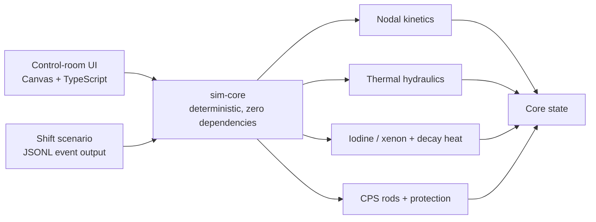

# RBMK-1000 Simulator

[](https://github.com/voidfreud/rbmk/actions/workflows/ci.yml)
[](https://bun.sh/)
[](https://www.typescriptlang.org/)

A deterministic, from-scratch RBMK-1000 reactor simulator with an interactive
control-room interface. Its positive void feedback, xenon transients, automatic
regulation, protection logic, and pre-1986 graphite-displacer effect emerge from
the model rather than from scripted outcomes.

> [!WARNING]
> This is educational simulation software—not a reactor design, licensing,
> training, or safety-analysis tool.

## See the plant

```bash
bun install --frozen-lockfile
bun run start
```

Open **http://localhost:3141/**. The interface starts at steady full power so
the instruments can be explored immediately. Use **cold start** for the full
startup procedure.

The UI includes:

- an individually selectable 211-rod CPS map with selsyn-style insertion depth;
- reconstructed radial channel power and a readable axial core profile;
- RR, AR, LAR, AZ, and bottom-entry USP rod behavior;
- ARM/AR/LAR regulation, subgroup changeover, rod-drive interlocks, and AZ-1;
- AZM overpower, AZS short-period, and AZ-5 scram behavior;
- shared-time trends for reactivity, power, period, and xenon;
- PRIZMA-style delayed ORM reporting and a chronological event log.

## Run the shift scenario

```bash
bun run demo
```

The scenario holds full power, reduces to 50%, rides the xenon transient,
returns to full power, and finishes with AZ-5. Human-readable output goes to the
terminal; structured JSONL is written to `logs/run.jsonl`.

## Physics model

The dependency-free simulation core uses 14 axial nodes across the 7 m active
core. Each node tracks:

- neutron flux and six delayed-neutron precursor groups;
- I-135 → Xe-135 production, decay, and burnup;
- fuel, graphite, and coolant temperatures;
- steam quality and void fraction;
- void, Doppler, graphite-temperature, xenon, and rod reactivity.

The stiff kinetics and feedback paths use implicit or semi-implicit integration.
Axial coupling is solved with an implicit tridiagonal diffusion sweep. Rod
geometry models a top-entering absorber, 4.5 m graphite displacer, and the
historical water gaps, allowing the initial positive scram effect to appear under
the appropriate low-ORM, bottom-peaked conditions.

Constants, units, source notes, confidence, and deliberately estimated values are
documented in [`docs/physics.md`](docs/physics.md).

## Architecture



```text
packages/sim-core/   pure deterministic physics and protection logic
packages/ui/         browser control room; subscribes to sim-core
scripts/demo.ts      multi-hour operator scenario
scripts/serve.ts     Bun development server
docs/                physics reconciliation and future plant research
```

## Verification

```bash
bun run check       # strict TypeScript + complete physics test suite
bun run smoke:ui    # serve and validate the browser entry point
bun run demo        # end-to-end multi-hour plant scenario
```

The tests cover steady operation, startup, inhour behavior, xenon, void
feedback, thermal response, graphite-tip reactivity, scram geometry, rod worth,
period blocks, regulator changeover, PRIZMA cadence, and fast-forward stability.
CI runs all three verification commands on every pull request and every push to
`main`.

## Scope and limitations

Implemented now:

- axial neutron kinetics and thermal feedback;
- quasi-static radial power reconstruction;
- CPS mechanics, automatic regulation, protections, instrumentation, and UI.

Deliberately deferred:

- dynamic hydraulic loops and drum separators;
- turbine-generator, condenser, grid, and electrical protection;
- a fully coupled radial nodal kinetics solution;
- plant-grade ORM reconstruction and safety qualification.

Research notes for those future systems are retained in
[`docs/research/`](docs/research/).

## Development

Requirements: [Bun 1.3.14](https://bun.sh/) or the version declared in
`package.json`.

```bash
bun install --frozen-lockfile
bun run typecheck
bun test
```

The core must remain deterministic and browser-independent: no wall-clock time,
unseeded randomness, browser APIs, or I/O inside `packages/sim-core`.
