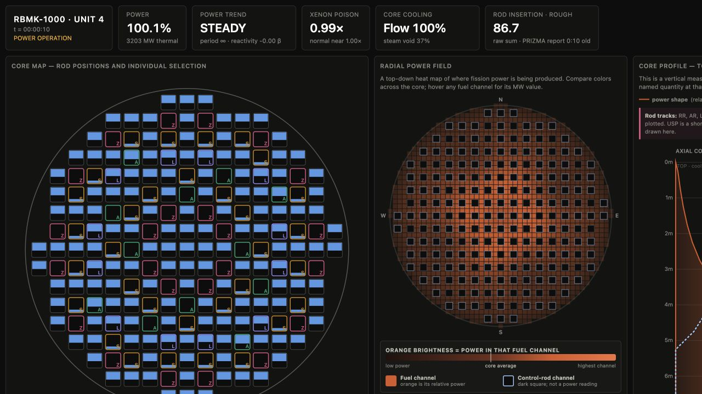
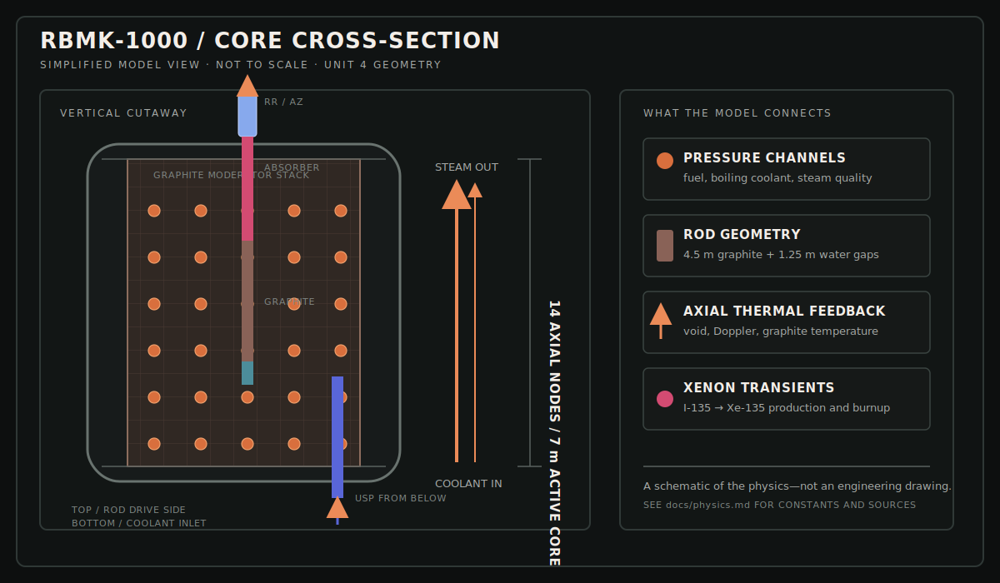

# RBMK-1000 Simulator

[](https://github.com/voidfreud/rbmk/actions/workflows/ci.yml)
[](https://bun.sh/)
[](https://www.typescriptlang.org/)

An interactive, deterministic RBMK-1000 control-room simulator. Turn rods,
watch xenon build up, ride positive void feedback, and see the pre-1986
graphite-displacer effect emerge from the model instead of from scripted
outcomes.

> [!WARNING]
> This is educational simulation software—not a reactor design, licensing,
> training, or safety-analysis tool.



_The simulator opens in steady full-power operation so the instruments are ready
to explore immediately._

## Start the shift

```bash
bun install --frozen-lockfile
bun run start
```

Open [http://localhost:3141/](http://localhost:3141/). Choose **cold start**
when you want to work through startup from a shutdown state.

| Start here | What it does |
| --- | --- |
| `bun run start` | Opens the interactive control room. |
| `bun run demo` | Runs a multi-hour operator scenario and writes `logs/run.jsonl`. |
| `bun run check` | Type-checks the project and runs the physics suite. |

## A look inside the model



_A not-to-scale cutaway of the geometry simulated by `sim-core`: graphite
moderation, vertical pressure channels, top-entering regulating and protection
rods, bottom-entry USP rods, upward coolant flow, and the 14-node axial model._

## A shift in three moves

The UI is built for experiments you can see and explain:

1. **Hold power:** watch the automatic regulator keep the reactor near setpoint.
2. **Change the load:** reduce to 50%, follow the iodine/xenon transient, and
   return to full power.
3. **Scram:** trigger AZ-5 and inspect the rod geometry, period, power, and
   chronological event log as the plant responds.

The scripted demo follows the same arc:

```text
steady full power  ──▶  50% power  ──▶  xenon transient  ──▶  full power  ──▶  AZ-5
```

## What is on the screen?

| Panel | What it shows |
| --- | --- |
| **Core map** | The individually selectable 211-rod CPS map with selsyn-style insertion depth. |
| **Radial power field** | A reconstructed top-down channel-power heat map. |
| **Core profile** | Axial power, rod tracks, coolant direction, and the top-to-bottom shape of the core. |
| **Trends** | Shared-time reactivity, power, period, xenon, and thermal signals. |
| **Protection and events** | ARM/AR/LAR regulation, AZ-1, AZM, AZS, AZ-5, PRIZMA-style ORM, and a chronological event log. |

## Physics model

The dependency-free simulation core uses 14 axial nodes across the 7 m active
core. Each node tracks:

- neutron flux and six delayed-neutron precursor groups;
- I-135 → Xe-135 production, decay, and burnup;
- fuel, graphite, and coolant temperatures;
- steam quality and void fraction;
- void, Doppler, graphite-temperature, xenon, and rod reactivity.

Stiff kinetics and feedback paths use implicit or semi-implicit integration.
Axial coupling is solved with an implicit tridiagonal diffusion sweep. Rod
geometry models a top-entering absorber, 4.5 m graphite displacer, and the
historical water gaps, allowing the initial positive scram effect to appear
under the appropriate low-ORM, bottom-peaked conditions.

Constants, units, source notes, confidence, and deliberately estimated values
are documented in [`docs/physics.md`](docs/physics.md).

## CPS: the real control structure matters

The simulator models the pre-1986 control and protection system rather than a
generic “insert all rods” switch:

| Group | Count | Behavior |
| --- | ---: | --- |
| RR | 131 | Manual regulating rods, driven in small squads. |
| AR | 12 | Automatic regulation, three subgroups with changeover. |
| LAR | 12 | Local automatic regulation. |
| AZ | 24 | Protection rods driven from above for AZ-5. |
| USP | 32 | Bottom-entry short-period protection; not driven by AZ-5. |

The model includes rod-drive interlocks, AZS short-period protection, AZM
overpower protection, AZ-1 setback, operator-blockable protections, and the
delayed PRIZMA-style ORM advisory below 15 rods. The reactor is genuinely
unstable open-loop because its positive void coefficient is part of the model;
the automatic regulator is what holds it.

## How the pieces fit

```text
                    ┌──────────────────────────────┐
                    │ Control-room UI + shift demo  │
                    └──────────────┬───────────────┘
                                   │ commands + state
                                   ▼
                    ┌──────────────────────────────┐
                    │ sim-core                      │
                    │ deterministic, zero-dependency│
                    └───┬────────┬────────┬─────────┘
                        │        │        │
                        ▼        ▼        ▼
                 kinetics   thermal   iodine/xenon
                        │        │        │
                        └────────┼────────┘
                                 ▼
                    ┌──────────────────────────────┐
                    │ core state + CPS protections  │
                    └──────────────────────────────┘
```

| Directory | Responsibility |
| --- | --- |
| `packages/sim-core/` | Pure deterministic physics and protection logic. |
| `packages/ui/` | Browser control room subscribing to `sim-core`. |
| `scripts/demo.ts` | Multi-hour operator scenario with JSONL output. |
| `scripts/serve.ts` | Bun development server. |
| `docs/` | Physics reconciliation and future plant research. |

## Verification

```bash
bun run check       # strict TypeScript + complete physics test suite
bun run smoke:ui    # serve and validate the browser entry point
bun run demo        # end-to-end multi-hour plant scenario
```

The tests cover steady operation, startup, inhour behavior, xenon, void
feedback, thermal response, graphite-tip reactivity, scram geometry, rod worth,
period blocks, regulator changeover, PRIZMA cadence, and fast-forward stability.
CI runs all three verification commands on every pull request and every push
to `main`.

## Scope and limitations

Implemented now:

- axial neutron kinetics and thermal feedback;
- quasi-static radial power reconstruction;
- CPS mechanics, automatic regulation, protections, instrumentation, and UI.

Deliberately deferred:

- dynamic hydraulic loops and drum separators;
- turbine-generator, condenser, grid, and electrical protection;
- a fully coupled radial nodal kinetics solution;
- plant-grade ORM reconstruction and safety qualification.

Research notes for those future systems are retained in
[`docs/research/`](docs/research/).

## Development

Requirements: [Bun 1.3.14](https://bun.sh/) or the version declared in
`package.json`.

```bash
bun install --frozen-lockfile
bun run typecheck
bun test
```

The core must remain deterministic and browser-independent: no wall-clock time,
unseeded randomness, browser APIs, or I/O inside `packages/sim-core`.
